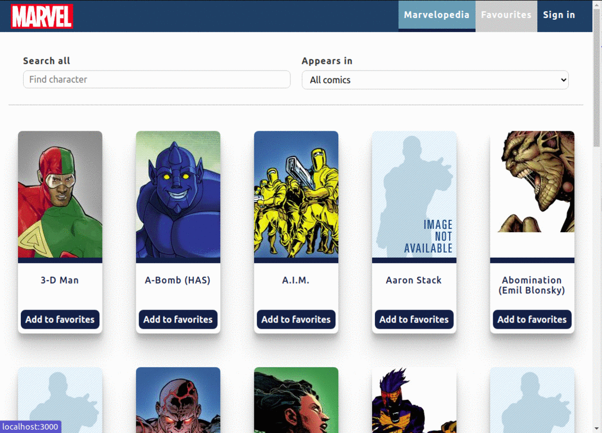
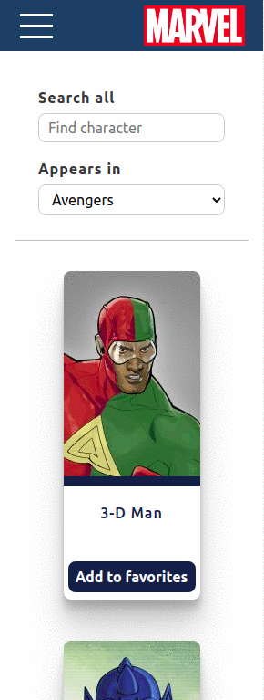

# Project description

Encyclopedia with Marvel's Characters. You can search, filter and check the comics creatures.
What is more, after siging in, all your favourites characters can be saved! Later on, you can find them really fast.

## Functions

1. Fetches data from an external Marvel API
2. Prop Types typings for React Components
3. Implemented Redux app state management
4. Implemented responsive design
5. Includes a mock authentication functionality- save a fake token to memory in order to access to the private root of the main app view after reloading or reopening the tab
6. Data presented as cards on a grid
7. Cards include shortened data from their respective data nodes and navigate to full data view when clicked
8. Allows users to access respective data nodes views by a URL with a name, e.g. `~/A.I.M.` to access A.I.M. character full data view
9. Search all resources
10. Filter by the comics title

## Perview of the application

## How to start the app with docker

The image is prepared to production build and it is run on ngnix server.

To run the image:

### `docker run -itp 8000:8000 karosowa/marvelopedia-front:1.0.0`

The app is running at [http://localhost:8000](http://localhost:8000).

## Build with docker

To build the image:

### `docker build -t karosowa/marvelopedia-front:1.0.0 .`

## How to start with npm

After downloading repository, in the project directory, you can run:

### `npm install`

and then

### `npm start`

Runs the app in the development mode.\
Open [http://localhost:3000](http://localhost:3000) to view it in the browser.

### `npm run build`

Builds the app for production to the `build` folder.\
It correctly bundles React in production mode and optimizes the build for the best performance.
